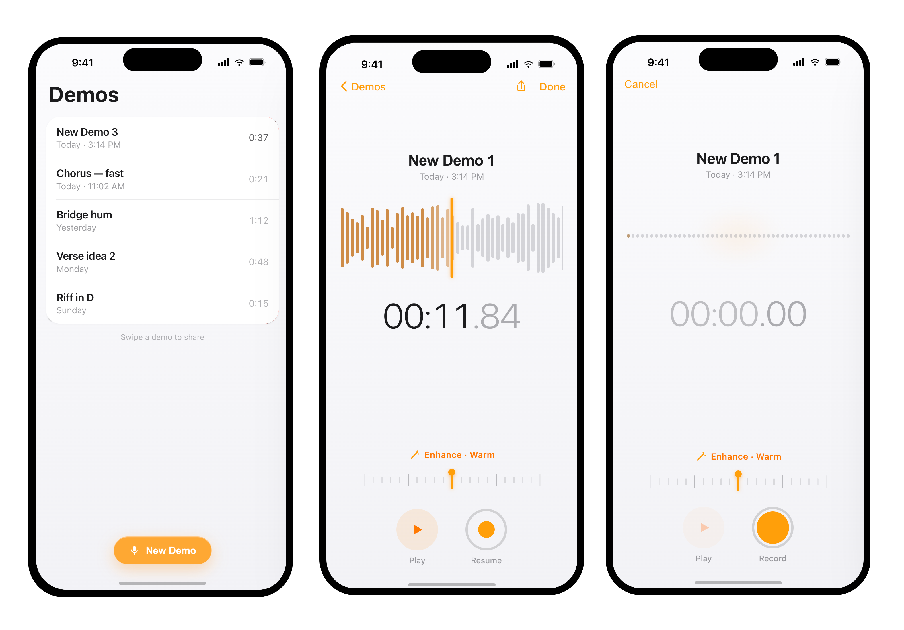

# Demo Memos

## What

**Voice Memos, but for song ideas.** High-quality recording with a touch of space and warmth. That's it.

## Why

The native Voice Memos app comes so close to what songwriters want: a way to quickly capture and share ideas. It's fast, simple, and always at hand. But it records voice, not music. Demo Memos keeps that one-tap simplicity and adds just enough studio: a clean capture + a single **Enhance** dial for warmth and space.

## What it does

- **One tap to record** — open, hit record, the idea is safe.
- **Warmth & space** — one dial adds analogue-style character; no menus, no plugins.
- **A shelf of ideas** — every demo named, dated, and a swipe away from sharing.

## Built in the open

Demo Memos is also the proving ground for [ai-sdlc](https://github.com/martin-pritchard/ai-sdlc),
my toolkit for running a disciplined, agent-assisted software lifecycle — the
principles, review gates, and guardrails that shaped this repo are exercised on
every commit here.

---

Native SwiftUI · iOS 26 · [Architecture principles](docs/PRINCIPLES.md) · [Decisions](docs/DECISIONS.md)
